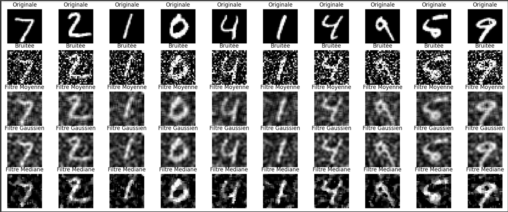
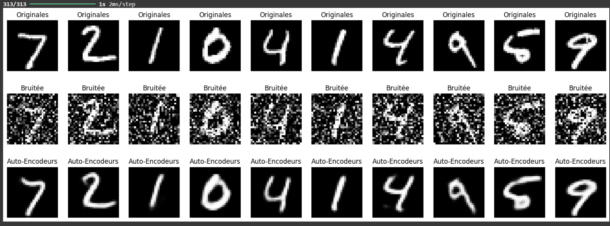
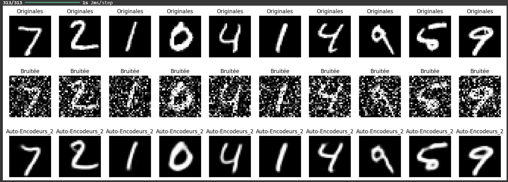
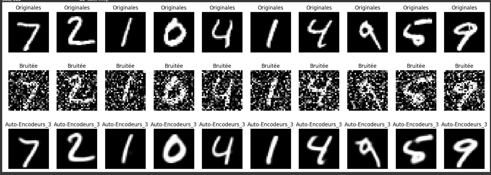
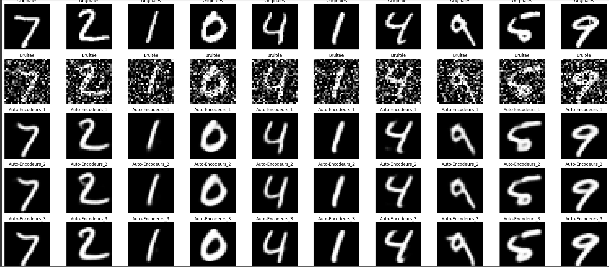

# Application of Autoencoders and Classical Techniques for Image Denoising

## 📌 Objective
The objective of this project is to understand the functioning of autoencoders, implement them, and use them for image denoising. We will learn how to:

### 1. Chargement et Préparation des Données
- Charger le jeu de données MNIST et ajouter du bruit.

### 2. Apply Traditional Filtering Techniques

#### 2.1 Visualisation des Résultats des Filtrages Classiques

#### 2.2 Évaluation Quantitative des Filtrages
**Interprétation des résultats PSNR :**

- **Filtre Moyenne (12.28) :** Offre une réduction basique du bruit, mais floute significativement les contours, ce qui impacte la qualité de reconstruction.
- **Filtre Gaussien (12.43) :** Légèrement meilleur que le filtre de moyenne grâce à sa pondération gaussienne, qui préserve un peu mieux les détails.
- **Filtre Médian (14.20) :** Donne les meilleurs résultats, car il supprime efficacement le bruit impulsionnel tout en conservant les contours nets, ce qui améliore la fidélité vis-à-vis des images originales.

### 3. Build an Autoencoder Model

#### 3.1 Construction de l'Autoencodeur

##### 3.1.1 Visualisation des Résultats

##### 3.1.2 Évaluation Quantitative PSNR
**Interprétation des résultats PSNR :**
PSNR moyen: 20.18

#### 3.2 Construction de l'Autoencodeur Avancé N1
(Ajout de couches supplémentaires)

##### 3.2.1 Visualisation des Résultats

##### 3.2.2 Évaluation Quantitative PSNR
**Interprétation des résultats PSNR :**
**Interprétation des résultats PSNR :**

#### 3.3 Construction de l'Autoencodeur Avancé N2
(Ajout de couches supplémentaires)

##### 3.3.1 Visualisation des Résultats

##### 3.3.2 Évaluation Quantitative PSNR
**Interprétation des résultats PSNR :**
PSNR moyen: 19.94

### 4. Comparaison des Résultats des Trois Modèles
- Comparaison des performances des autoencodeurs  pour la réduction de bruit.
- 

---
📌 **Note:** Les images de sortie et les résultats des évaluations sont disponibles dans le dossier `images/`. Assurez-vous d'exécuter le notebook pour générer les résultats.
